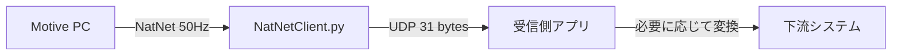

# GPS_NED_w_timestamp

## 概要
OptiTrack Motive から NatNet で剛体データを受け取り、Motive 座標を NED と GPS に変換して、剛体 ID ごとに UDP 送信する Python アプリです。送信データは pickle ではなく、`struct` による固定長バイナリです。記録機能を有効にすると、実行中のフレームを CSV に保存できます。

このフォルダの主な実行入口は [PythonSample.py](PythonSample.py) です。設定は [config.json](config.json) から読み込みます。

## 何をするアプリか
1. Motive から 50Hz 前後の剛体フレームを受信します。
2. 剛体位置を Motive 座標系から NED に変換します。
3. NED を基準 GPS 座標からの相対位置として緯度・経度・高度に変換します。
4. 姿勢から Yaw を算出します。
5. 剛体 ID ごとに、設定された送信先へ UDP 送信します。
6. 必要に応じて、フレームデータを CSV に記録します。

## 実行イメージ
```mermaid
flowchart LR
    Motive[OptiTrack Motive] -->|NatNet| Client[NatNetClient.py]
    Client --> Convert[座標変換\nMotive -> NED -> GPS]
    Client --> Packet[31バイト固定長 UDP\nstruct.pack('<BiiiHdd')]
    Client --> Recording[CSV記録\nrecord_YYYYMMDD_HHMMSS.csv]
    Packet --> Targets[剛体IDごとの送信先IP]
```

## ファイル構成
```text
GPS_NED_w_timestamp/
├── config.json
├── NatNetClient.py
├── PythonSample.py
├── DataDescriptions.py
├── MoCapData.py
├── PythonClient.pyproj
├── PythonClient.sln
├── DESIGN.md
└── README.md
```

## 使い方
### 1. 依存ライブラリを入れる
```bash
pip install pyned2lla
```

### 2. 設定を編集する
[config.json](config.json) で、送信したい剛体 ID と送信先 IP を設定します。

```json
{
  "udp_targets": {
    "1": "192.168.11.16",
    "2": "192.168.11.61"
  },
  "recording_enabled": true
}
```

### 3. 起動する
```bash
python PythonSample.py
```

### 4. 操作する
`recording_enabled` が `true` のとき、PythonSample.py のキーボード監視で次の操作が使えます。

- `Enter`: 記録開始 -> 全0行を1行追加 -> 記録停止して CSV 保存
- `q`: 終了
- `h`: ヘルプ表示

### 5. 停止する
`Ctrl+C` で停止します。

## 設定項目
### `udp_targets`
剛体 ID と送信先 IP アドレスの対応表です。たとえば次のように設定します。

```json
{
  "udp_targets": {
    "1": "192.168.11.16",
    "2": "192.168.11.61",
    "3": "192.168.11.70"
  }
}
```

### `recording_enabled`
記録機能の有効/無効です。

- `true`: 記録を有効化
- `false`: 記録を無効化

設定ファイルの読み込みに失敗した場合は、送信先なし・記録無効として起動します。

## 技術資料

### 1. システム全体の役割分担
このフォルダは Motive PC 側の送信処理を担当します。下流の受信側では、この UDP バイナリを受けて GPS/MAVLink などに変換できます。



### 2. 時刻同期の考え方
Motive のフレームサフィックスから得られる `timestamp` を毎フレーム使い、起動時に一度だけ取得した Unix 時刻を基準に補間します。

```text
base_motive_ts = 初回フレームの Motive timestamp
base_unix      = 初回フレーム受信時の time.time()

unix_time_sec = base_unix + (timestamp - base_motive_ts)
```

この方式により、`time.time()` のジッタは起動時の定数オフセットに限定され、フレーム間の相対時間は Motive の timestamp を基準に保てます。

### 3. 座標変換
- Motive 座標の位置は NED に変換してから GPS に変換します。
- 位置変換は次の対応です。
  - `x -> North`
  - `z -> East`
  - `y -> Down` は符号反転
- 姿勢クォータニオンも同じ軸対応で変換します。
- 変換後の GPS は `pyned2lla` を使って基準緯度・経度・高度から求めます。
- 緯度・経度は 7 桁精度、高度は 3 桁精度に丸めます。
- Yaw は変換後クォータニオンから 0 から 360 度の範囲で算出します。

### 4. UDP ペイロード
送信パケットは固定長 31 バイトです。

```python
struct.pack('<BiiiHdd',
            rigid_body_id,
            gps_lat_degE7,
            gps_lon_degE7,
            gps_alt_mm,
            yaw_cdeg,
            motive_timestamp,
            unix_time_sec)
```

| フィールド | 型 | 説明 |
|---|---|---|
| rigid_body_id | uint8 | 剛体 ID |
| gps_lat_degE7 | int32 | 緯度を $10^7$ 倍した整数 |
| gps_lon_degE7 | int32 | 経度を $10^7$ 倍した整数 |
| gps_alt_mm | int32 | 高度を mm に変換した整数 |
| yaw_cdeg | uint16 | Yaw を $10^2$ 倍した整数 |
| motive_timestamp | float64 | Motive のフレームタイムスタンプ |
| unix_time_sec | float64 | 基準 Unix 時刻から補間した秒数 |

受信側は `struct.unpack('<BiiiHdd', data[:31])` で復元できます。

### 5. CSV 記録
記録停止時に `~/Downloads/record_YYYYMMDD_HHMMSS.csv` へ保存します。CSV の列は次の順です。

| カラム名 | 説明 |
|---|---|
| motive_timestamp | Motive のフレームタイムスタンプ |
| unix_time_sec | 補間した Unix 時刻 |
| rigid_body_id | 剛体 ID |
| pos_x | Motive 位置 X |
| pos_y | Motive 位置 Y |
| pos_z | Motive 位置 Z |
| qx | クォータニオン X |
| qy | クォータニオン Y |
| qz | クォータニオン Z |
| qw | クォータニオン W |

### 6. 基準 GPS 座標
基準値は [NatNetClient.py](NatNetClient.py) 内で次のように設定されています。

```python
self.ref_lat = 36.0757800
self.ref_lon = 136.2132900
self.ref_alt = 0.000
```

### 7. 注意事項
- Motive 側でストリーミングが有効になっている必要があります。
- UDP 送信先は到達可能な同一ネットワーク上の IP を指定してください。
- UDP 送信ポートは 15769 です。
- 長時間記録すると CSV は大きくなります。

### 8. トラブルシューティング
- データが来ない場合は、Motive のストリーミング設定とファイアウォールを確認してください。
- UDP 送信エラーが出る場合は、送信先 IP とネットワーク到達性を確認してください。
- 記録できない場合は、`config.json` の `recording_enabled` とキーボード入力を確認してください。

## 補足
- Python 3.x
- 依存ライブラリ: `pyned2lla`
- UDP 送信ポート: 15769
